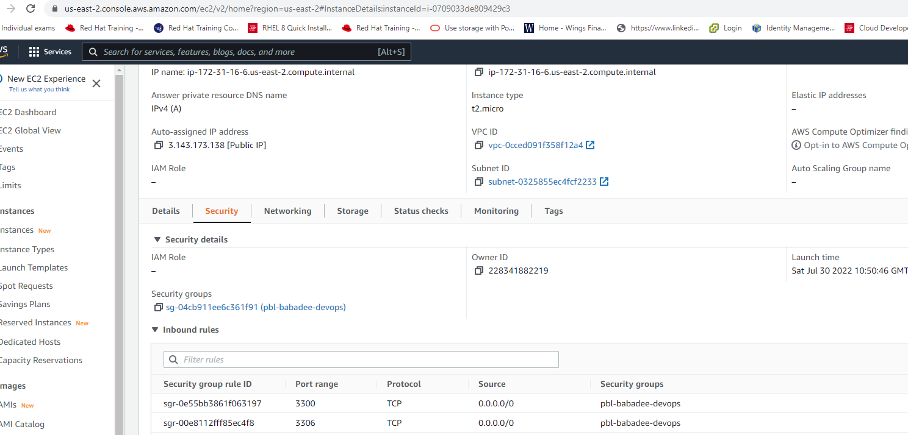
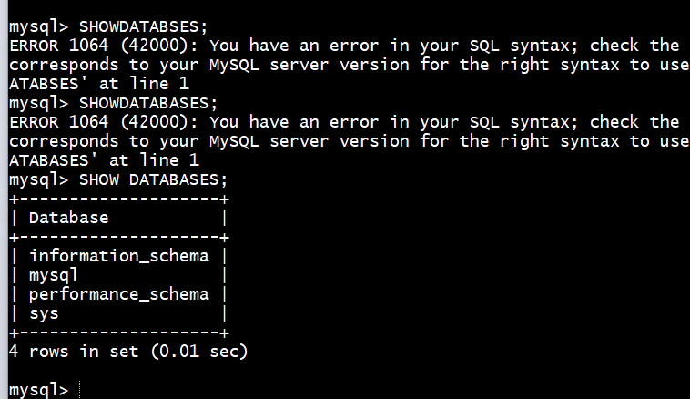

 # Project 5 - Create and configure two Linux-based virtual servers (EC2 instances in AWS). 
## Server A name - `mysql server`
## Server B name - `mysql client`

### Step 1  On mysql client Linux Server I installed MySQL Client software. 

` sudo apt update `

` sudo apt-get install mysql-client -y `

## Step 2 On mysql server Linux Server I install MySQL server software. 

` sudo apt update `

` sudo apt install mysql-server -y `

* By default, both EC2 virtual servers are located in the same local virtual network so this will allow comunication btween both machines `

## Using mysql server's local IP address to connect from mysql client. MySQL server uses TCP port 3306 by default, I opened port 3306 on mysql server `

* For extra security, do not allow all IP addresses to reach your ‘mysql server’ – allow access only to the specific local IP address of your ‘mysql client’. 

## Step 3  You might need to configure MySQL server to allow connections from remote hosts. allowing access from mysql client

` sudo vi /etc/mysql/mysql.conf.d/mysqld.cnf  >> Replaced ‘127.0.0.1’ to ‘0.0.0.0’ `

 

* By default, mysql username and password you are using is allowed to access mysql-server locally. 

## Step 4 I created a separate user for the purpose of the remote connection called babadeen by runing the below command.

` CREATE USER 'babadeen'@'172.31.31.27' IDENTIFIED BY 'abcd1234'; `

* Run a command like below to access from all machines and all databases.

GRANT ALL PRIVILEGES ON database.* TO 'babadeen'@'172.31.31.27'; OR
GRANT ALL PRIVILEGES ON *.* TO 'babadeen'@'%';

* Run a command like below to give access from specific IP

` GRANT ALL PRIVILEGES ON *.* TO 'babadeen'@'172.31.31.27; `

* Finally, you may also need to run
 
 ` FLUSH PRIVILEGES;`

 
 
* Restart mysql server. ` 

` sudo /etc/init.d/mysql restart `

* Testing remote Connection

` mysql -h 172.31.16.6 -u babadeen -pabcd1234 `

*  If you get a mysql shell, don’t forget to run show databases; to check if you have right privileges from remote machines.

